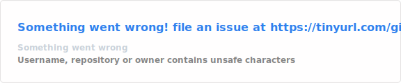
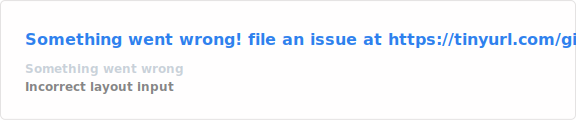

<!-- Profile README for github.com/AbdurRahman599 -->

<!-- Banner -->


<!-- Typing animation -->
<p align="center">
  <a href="https://github.com/AbdurRahman599">
    
  </a>
</p>

<!-- Contact and profile badges -->
<p align="center">
  <a href="mailto:Rahman527386@gmail.com">
    
  </a>
  <a href="https://www.linkedin.com/in/abdur-rahman9/">
    
  </a>
  
  
</p>

## `> whoami`

```typescript
const abdurRahman = {
  role: "Full-Stack Software Engineer",
  location: "Chattogram, Bangladesh 🇧🇩",

  currentWork:
    "Channel Partner Panel — an API-driven student application platform",

  stack: {
    backend: ["PHP", "Laravel", "REST APIs", "MySQL", "Node.js"],
    frontend: ["JavaScript", "Blade", "HTML5", "CSS3", "Bootstrap"],
    tools: ["Git", "GitHub", "Postman"],
    exploring: ["Machine Learning", "AI-assisted development"],
  },

  philosophy:
    "Write code humans can read; machines will figure it out.",
};
```

## `> current --focus`

- Building and maintaining scalable Laravel applications and REST APIs
- Improving backend architecture, database design, and application workflows
- Creating clean, responsive interfaces with JavaScript, Blade, and Bootstrap
- Exploring machine learning and practical AI-assisted development

## `> tech --stack`

<table>
  <tr>
    <td valign="top" width="33%">
      <h4 align="center">⚙️ Backend</h4>
      <p align="center">
        
      </p>
    </td>
    <td valign="top" width="33%">
      <h4 align="center">🎨 Frontend</h4>
      <p align="center">
        
      </p>
    </td>
    <td valign="top" width="33%">
      <h4 align="center">🧰 Tools & More</h4>
      <p align="center">
        
      </p>
    </td>
  </tr>
</table>

## `> ls ./featured-projects`

<table>
  <tr>
    <td width="50%" valign="top">
      <h4>
        <a href="https://github.com/AbdurRahman599/Ovenza">🛒 Ovenza</a>
      </h4>
      <p>
        Full-featured Laravel e-commerce application with product catalog,
        cart, and order-management functionality.
      </p>
      <p>
        
        
        
      </p>
    </td>
    <td width="50%" valign="top">
      <h4>
        <a href="https://github.com/AbdurRahman599/House_Rental_Management_System">🏠 House Rental Management System</a>
      </h4>
      <p>
        Application for managing rental properties, tenants, and payment records.
      </p>
      <p>
        
      </p>
    </td>
  </tr>
  <tr>
    <td width="50%" valign="top">
      <h4>
        <a href="https://github.com/AbdurRahman599/News-Article-Share-Prediction">📈 News Article Share Prediction</a>
      </h4>
      <p>
        Machine-learning model that predicts the potential virality of online
        news articles from content features.
      </p>
      <p>
        
        
      </p>
    </td>
    <td width="50%" valign="top">
      <h4>
        <a href="https://github.com/AbdurRahman599/Affix">⚡ Affix</a>
      </h4>
      <p>
        Front-end web project focused on dynamic and interactive user interfaces.
      </p>
      <p>
        
      </p>
    </td>
  </tr>
</table>

## `> github --activity`

<!--
  These cards are generated as local SVG files by:
  .github/workflows/update-readme-cards.yml

  This avoids depending on the public github-readme-stats endpoint every time
  somebody opens the profile.
-->

<p align="center">
  
  
</p>

<p align="center">
  <a href="https://github.com/DenverCoder1/github-readme-streak-stats">
    
  </a>
</p>

## `> contact --me`

<p align="center">
  <a href="mailto:Rahman527386@gmail.com">
    
  </a>
  &nbsp;
  <a href="https://www.linkedin.com/in/abdur-rahman9/">
    
  </a>
  &nbsp;
  <a href="https://github.com/AbdurRahman599">
    
  </a>
</p>

<p align="center">
  <i>💡 Open to interesting projects and collaboration — let’s build something meaningful.</i>
</p>

<!-- Footer -->

